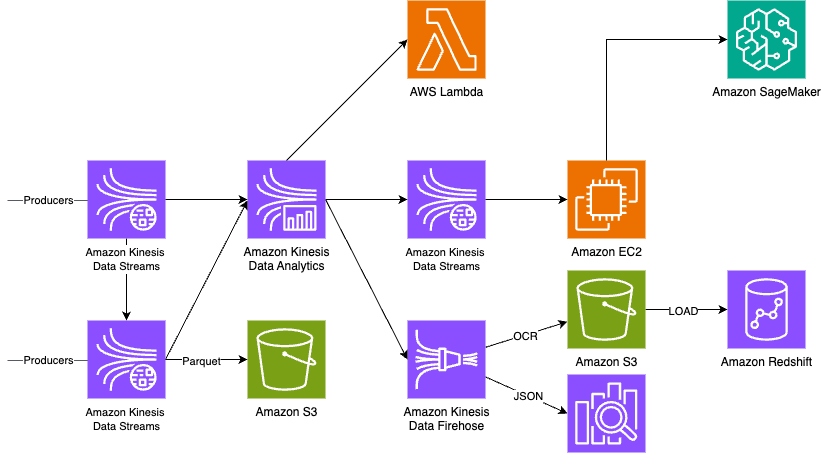

# Full Data Engineering Pipeline 

## Real-Time Layer

## Video Layer

::: mermaid
graph LR;

    videoProducers,DeepLens--->KinesisVideoStreams
    KinesisVideoStreams-->Rekognition
    Rekognition-->KinesisDataStreams
    KinesisDataStreams-->Amazon_EC2
    KinesisDataStreams--> KinesisDataAnalytics
    KinesisDataStreams--> KinesisDataFirehose
    
    KinesisVideoStreams--> AmazonEC2
    AmazonEC2--> Kinesis_Data_Streams
    Kinesis_Data_Streams --> AWS_Lambda
    AmazonSageMaker --> AmazonEC2
:::

## Batch Layer

::: mermaid
graph LR;

    MySQL-On-Premise --> AWS-Database-Migration-Service(DMS)--> Amazon-RDS-->AWS-DataPipeline-->AWS-S3-->AWS-Glue-ETL--PARQUET-->AmazonS3<--Cleanup-Task-->AWS-Batch
    Amazon-DynamoDB-->AWS-Data-Pipeline--JSON-->AWS-S3
    Amazon-DynamoDB -.Crawler..->AWS-Glue-Data-Catalog
    Amazon-RDS-.Crawler..->AWS-Glue-Data-Catalog
    AWS-S3-.Crawler.->AWS-Glue-Data-Catalog
    AWS-Glue-ETL-.Crawler.->AWS-Glue-Data-Catalog
:::

----
 
